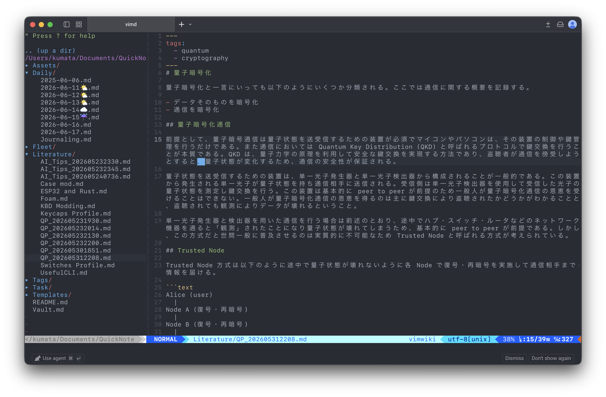
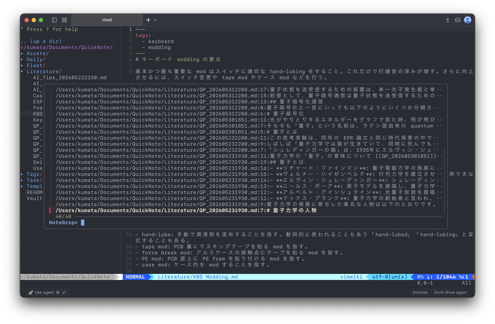

# Quick Note

Quick Note は、Vim 上で Obsidian 風のノート運用を行うための設定一式です。`quicknote.vim` がノート機能を担当し、`private.vim` が日常利用向けの Vim 設定と plugin 定義を担当します。




## この repository に含まれるファイル

- `private.vim`
  - `vim-plug` の plugin 定義
  - 一般的な Vim 設定
  - NERDTree、airline、Git キーマップなどの汎用設定
- `quicknote.vim`
  - QuickNote 固有の設定
  - `:NoteToday` コマンドの実装
  - `:NoteLiterature` コマンドの実装
  - `:NoteFleet` コマンドの実装
  - `:NoteSearch`、`:NoteGrep`、`:NoteBacklinks`、`:NoteTag`、`:NoteTags` コマンドの実装
  - `[[link]]` を `<Enter>` で開く mapping (ファイルがなければファイルを**自動生成**)
  - template token 置換
- `sample.vim`
  - `.vimrc` から `private.vim` と `quicknote.vim` を読み込む最小例

## 主な機能

- `~/Documents/QuickNote` を既定 root とした markdown ノート管理
- `[[note-name]]` 形式の wiki link を `<Enter>` でオープン
- `:NoteToday` で `Daily/YYYY-MM-DD.md` を作成またはオープン
- `:NoteLiterature {name}` で `Literature/{name}.md` を作成またはオープン
- `:NoteFleet {name}` で `Fleet/{name}.md` を作成またはオープン
- 存在しない `[[link]]` から `Fleet/{link}.md` を作成
- `:NoteSearch` で note file を FZF 検索
- `:NoteGrep` で note 本文を FZF grep
- `:NoteBacklinks` で現在の note を参照している `[[name]]` を FZF 検索
- `:NoteTag {tag}` で frontmatter の `tags:` ブロックに指定タグを持つ note を FZF 検索
- `:NoteTags` で frontmatter tag 一覧を FZF 選択し、選択 tag の note 検索へ進む
- markdown 編集時に `(`、`[`、`{` の対になる括弧を自動入力
- Obsidian 互換の template token 置換
- 同名 note が複数ある場合の FZF 選択

## 前提条件

- Vim のインストール
- `vim-plug` のインストール
- `find` コマンドが利用できる環境
- `grep` コマンドが利用できる環境

`private.vim` では次の plugin を読み込みます。

- `preservim/nerdtree`
- `vim-airline/vim-airline`
- `vim-airline/vim-airline-themes`
- `tpope/vim-commentary`
- `rust-lang/rust.vim`
- `pangloss/vim-javascript`
- `leafgarland/typescript-vim`
- `plasticboy/vim-markdown`
- `tpope/vim-fugitive`
- `vimwiki/vimwiki`
- `junegunn/fzf`
- `junegunn/fzf.vim`
- `rbtnn/vim-ambiwidth`
- `joshdick/onedark.vim`

## 導入手順

1. repository を取得して設定ファイルを配置します。

   ```shell
   git clone https://github.com/tkumata/quicknote.vim.git
   cp quicknote.vim/private.vim ~/.vim/private.vim
   cp quicknote.vim/quicknote.vim ~/.vim/quicknote.vim
   ```

2. `.vimrc` から `private.vim` と `quicknote.vim` を読み込みます。

   ```vim
   source ~/.vim/private.vim
   
   " QuickNote の保存先を変える場合は source より前に指定する
   let g:quicknote_root = '~/Documents/QuickNote'
   
   source ~/.vim/quicknote.vim
   ```

   `sample.vim` は上記構成の最小例です。

3. Vim を起動して plugin をインストールします。

   ```vim
   :PlugInstall
   ```

4. QuickNote の保存先ディレクトリを作成します。

   ```shell
   mkdir -p ~/Documents/QuickNote/Daily
   mkdir -p ~/Documents/QuickNote/Fleet
   mkdir -p ~/Documents/QuickNote/Literature
   mkdir -p ~/Documents/QuickNote/Templates
   ```

## コマンド

- `:NoteToday`
  - `Daily/YYYY-MM-DD.md` を開きます。
  - file が存在しない場合は `Templates/Daily.md` があれば内容を展開して作成します。
  - template がなくても空の buffer として開けます。
- `:NoteLiterature {name}`
  - `Literature/{name}.md` を開きます。
  - `{name}` に `.md` がなければ自動で付与します。
  - file が存在しない場合は `Templates/Literature.md` から作成します。
  - `Templates/Literature.md` がない場合は error を表示して終了します。
- `:NoteFleet {name}`
  - `Fleet/{name}.md` を開きます。
  - `{name}` に `.md` がなければ自動で付与します。
  - file が存在しない場合は最小の markdown note を作成します。
  - `{name}` 内の `/` は subdirectory として扱わず、file name 用に `-` へ置換します。
- `:NoteSearch`
  - QuickNote root 配下の markdown file を FZF で選択して開きます。
  - FZF が利用できない場合は error を表示します。
- `:NoteGrep [query]`
  - QuickNote root 配下の markdown file 本文を grep し、結果を FZF で選択します。
  - `[query]` を省略した場合は検索語を入力します。
  - FZF grep support が利用できない場合は error を表示します。
- `:NoteBacklinks`
  - 現在開いている note の filename stem と markdown H1 title をもとに `[[name]]` 参照を検索します。
  - 検索結果を FZF で選択し、参照元 file の該当行を開きます。
  - FZF が利用できない場合は error を表示します。
- `:NoteTag {tag}`
  - QuickNote root 配下の markdown file から、frontmatter の `tags:` ブロックに `{tag}` を持つ note を検索します。
  - 対象は `tags:` ブロック内の `- tag` 形式です。
  - YAML の inline list や本文内 tag は対象外です。
  - 検索結果を FZF で選択し、該当 note を開きます。
  - FZF が利用できない場合は error を表示します。
- `:NoteTags`
  - QuickNote root 配下の markdown file から、frontmatter の `tags:` ブロックにある tag 一覧を集めます。
  - tag を FZF で選択すると、`:NoteTag {tag}` と同じ検索結果へ進みます。
  - 対象は `tags:` ブロック内の `- tag` 形式です。
  - YAML の inline list や本文内 tag は対象外です。
  - FZF が利用できない場合は error を表示します。

## wiki link の開き方

markdown buffer では `<Enter>` によってカーソル下の `[[link]]` を開きます。

- 一致する file が 1 件ならそのまま開きます。
- 0 件なら `Fleet/{link}.md` を作成して開きます。
- 複数件なら `:FZF` が利用できる場合に候補選択へ渡します。
- `:FZF` が利用できない場合は候補一覧を表示します。

## 括弧自動補完

QuickNote の markdown 編集では、insert mode で開き括弧を入力すると対になる閉じ括弧も入力します。

- `(` は `()` になります。
- `[` は `[]` になります。
- `{` は `{}` になります。

カーソルは括弧の間に置かれます。

## 補足

- `g:quicknote_root` は `quicknote.vim` を source する前に設定してください。
- root path の末尾に `/` が付いていても内部で正規化されます。
- `quicknote.vim` は `vimwiki` を markdown mode で利用する前提です。

## template の書き方

QuickNote が置換する token は次の通りです。

- `{{title}}`
- `{{date}}`
- `{{time}}`
- `{{date:FORMAT}}`
- `{{time:FORMAT}}`

`FORMAT` では次の表記が使えます。

- `YYYY`
- `MM`
- `DD`
- `HH`
- `mm`
- `ss`
- `ddd`
- `dddd`

`NoteToday` は `Daily.md` 内の `{{cursor}}` を見つけると、その位置へカーソルを移動して token 自体を削除します。

例:

```md
# {{date:YYYY-MM-DD}} {{date:ddd}}

- [ ] 

{{cursor}}
```

```md
# {{title}}

Created: {{date}} {{time}}
```
